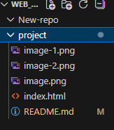
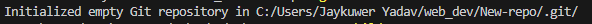
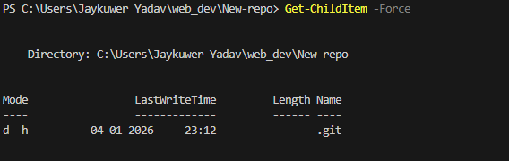
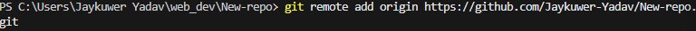
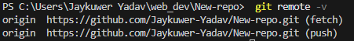
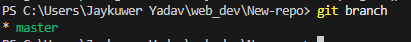
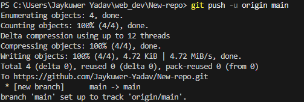
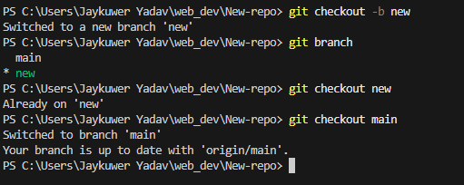
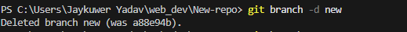

# project

hi this is Jay
git commands

1.  git version
2.  git config --global user.name"user.name"
3.  git config --global user.email"jayyad71@gmail.com"
4.  git config --list
5.  git status
6.  cd to go into github folder....
7.  clear
8.  ls (list to check files)
9.  Get-ChildItem -Force (Too get hidden files )
    Basic all files: ls -Force or Get-ChildItem -Force shows everything including hidden/system files.
    Detailed view: ls -Force | Format-Table -AutoSize gives a table-like output similar to ls -la.
    ​ Long format: ls -Force | Select-Object Name, Length, LastWriteTime mimics ls -l with name, size, and date.
10. after that we see (M)
    git has 4 files 1. untracked 2.modified 3.staged 4.unmodified
    2.modified files which u have modified
    For Untracked files:- means we made a new file in our folder apart from read.me
    staged :- ready to commit
    unmodified:- unchanged
    
11. git add <file name> eg. git add README.md
    11(a). git add .(for adding all files in our directory)
12. git commit -m "some message" (holds record of change)
    if error came as
    Changes not staged for commit:
    (use "git add <file>..." to update what will be committed)
    (use "git restore <file>..." to discard changes in working directory)
    modified: README.md
    no changes added to commit (use "git add" and/or "git commit -a")
    don't use git restore it is used for restoring the global(remote) doc by deleting our local one
    After commit i used
13. git push origin main
    error i got from there is
    remote: Invalid username or token. Password authentication is not supported for Git operations.
    fatal: Authentication failed for 'https://github.com/Jaykuwer-Yadav/project.git/'( means :- GitHub stopped accepting passwords for Git operations in 2021. You need a Personal Access Token (PAT) instead)
    how i fixed it?
    Step 1: Create GitHub PAT (2 minutes)
    Go to github.com/settings/tokens
    Click "Generate new token (classic)"
    Select scopes: repo (full repo access) → Generate token
    Copy the token (starts with ghp\_) - save it securely!
    Step 2: Use Token in VS Code Terminal
    Option A: Update Remote URL (Recommended)
    git remote set-url origin https://github.com/Jaykuwer-Yadav/project.git
    When it asks for password, paste your PAT (not GitHub password).
    Option B: VS Code GitHub Sign-in (Easiest)
    Ctrl+Shift+P → "GitHub: Sign in"
    Follow browser prompts → Done forever
    Step 3: Clear Old Credentials (Windows)
    text
    git credential-manager-core erase (this doesn't work)
    Then retry push - it will prompt for new token.
14. a. After git push origin
    Enumerating objects: 10, done.
    Counting objects: 100% (10/10), done.
    Delta compression using up to 12 threads
    Compressing objects: 100% (7/7), done.
    Writing objects: 100% (8/8), 4.72 KiB | 4.72 MiB/s, done.
    Total 8 (delta 2), reused 0 (delta 0), pack-reused 0 (from 0)
    remote: Resolving deltas: 100% (2/2), done.
    To https://github.com/Jaykuwer-Yadav/project.git
    f7c6ce0..a286148 main -> main
15.#### <u>use of INIT Commands</u>
use to create a new repo
now we need to make a new directory using terminal in our folder 
command is 
first use cd ..
1. ***mkdir New-repo***
pic :- 
see we made new repo
After that we need to see folders does our Folder is git folder or not we need to identify it first using ls ***ls***
but we need to initialize the folder as git folder using 
***git init***

After that we need to see files we use this code before 
as ***Get-ChildItem -Force***

 A Quick guide from GITHUB
 
 To add our files locally to remote folder using ***git remote add origin " your link of new repo u created"

To verify your remote Repo we use code ***git remote -v***

For verifying our Git branch
***git branch***

we see master??
we can change this branch as main as we did all work on our main 
so we will use ***git branch -M (rename)***
we did ***git push origin main*** many times now we set upstream for our future things to get easy so we will use use git code as ***git push -u*** y this only??
git push -u origin main pushes your commits and sets up "upstream tracking" so future git push works without typing the full command.
for eg we say GitHub that we won't write full program we will use this command as 
***git push -u***
to set this  we use ***git push -u origin main*** 

then we can use See [line 97 code here](#L97)
Don't directly use Push command before that Add and Commit 
#### Branches
to see in which branch we are in we use ***git branch***
to rename we use ***git branch -M (name)***
To make new branch we use ***git checkout -b <-brach name->***
to checkout from the branch we use ***git checkout***

to delete ***git checkout -d new***

 